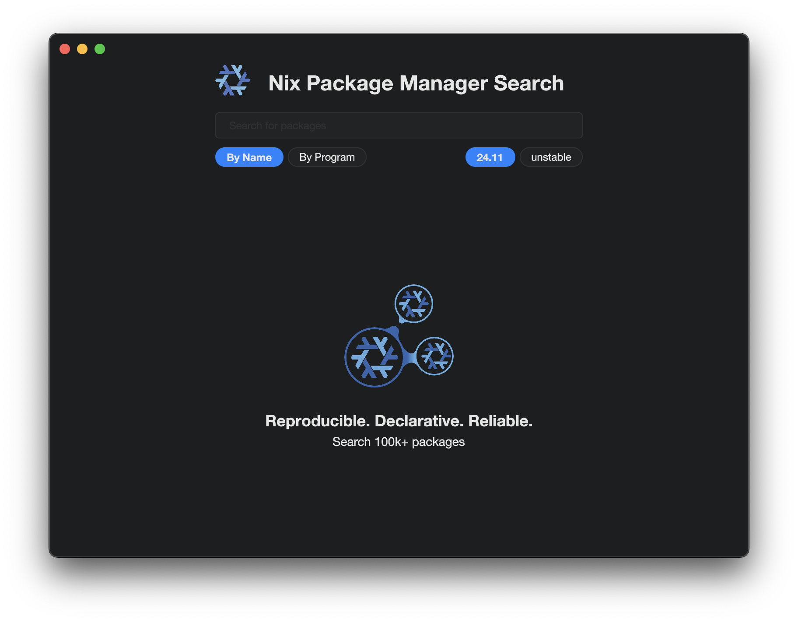

# Newt

`Newt` is a basic search tool which allows
you to search nixpkgs without having to use 
the website. It doesn't use a web render / web view, 
so it should remain relatively light on resources. 

## What's It Look Like?

I tried my best to make it look like a nice native clean MacOS application. 

## Also Included In Repo.

I also wrote a tool called `gnix`, which I use as 
a wrapper for nix, and some convenience tooling, such 
as displaying what the current nix channels are, and 
displaying installed packages, with additional information.

I plan to mainstream a the gnix featureset directly into the 
newt-gui, just for my convenience.

## Installation. 

I _think_ you can just download, and then type 
`just` once you have the [justfile command runner](https://github.com/casey/just) installed to install. If you think this belongs in nixpkgs please add. I'm a busy person so I'm not sure how maintained I can keepthis however.

## Does it work?

It works wonderfully (on my machine). I use it everyday.

## Contributions.

As always, PR's welcome :D

